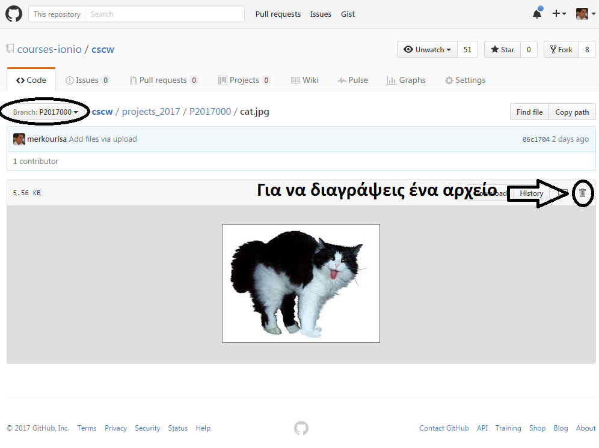

# Οδηγίες για εγγραφή σε μάθημα και αποστολή παραδοτέου

Ο πιο εύκολος τρόπος χρήσης του Github είναι μέσω της σελίδας του.

Σας επισημαίνουμε ότι οι εικόνες (**screenshots**) των οδηγιών που ακολουθούν είναι **ενδεικτικές**.

## Διαγραφή αρχείου

Για να σβήσεις ένα αρχείο από το φάκελο σου απλά το επιλέγεις και πατάς delete. 

Σημείωση: Αν σβήσεις όλα τα αρχεία από τον φάκελο σου τότε θα σβηστεί και ο ίδιος ο φάκελος.

Μην ξεχνάς κάθε φορά που κάνεις αλλαγές στο προσωπικό σου branch (201XXXX) θα πρέπει οπωσδήποτε να κάνεις και pull request ώστε οι αλλαγές να περάσουν και στο master branch.

